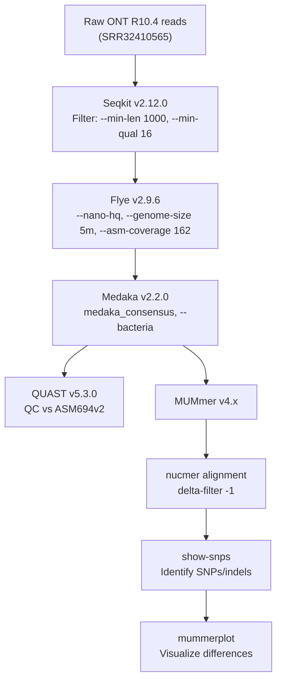

# Genome assembly and variant analysis of *Salmonella enterica* from nanopore long reads

## Introduction
The development of whole genome sequencing and assembly technology has enabled foundational discoveries for understanding virulence factors and pathogen evolution, particularly for clinically relevant species (1). *De novo* genome assembly refers to the recovery of an organism's genome without mapping sequenced DNA fragments to a reference. Unlike reference mapping, *de novo* assembly avoids reference bias, enables the discovery of novel sequences, and facilitates the identification of structural variation (2). However, the process can present notable challenges that hinder the construction of complete, accurate genomes. A notable challenge in *de novo* assembly is balancing read length and accuracy. Short-read sequencing produces highly accurate reads, but building long, contiguous sequences is challenging because repetitive elements are longer than the reads. Even with high sequencing coverage, short reads may not span these repeats, limiting the completeness of the assembly (3). In contrast, long-read sequencing technologies such as Oxford Nanopore Technologies (ONT) generate reads that span repetitive regions and produce more contiguous assemblies, but have until recently been unreliable due to systematic errors such as inaccurate homopolymer detection (4).

ONT long-read sequencing works by guiding a DNA or RNA molecule through a protein nanopore fixed to a flow cell membrane. As the molecule passes through the channel, multiple adjacent nucleotides influence the electrical current, producing a signal that is translated into a sequence. Unlike short-read sequencing, the DNA molecule does not need to be fragmented or amplified, enabling the formation of long, contiguous sequences (5). With their latest R10 chemistry, the nanopore channel is longer, allowing for dual sensors that better inform the electrical signals used for basecalling and produce more accurate results (4).

This analysis focuses on assembling the *Salmonella enterica* genome and comparing its variants to a reference using raw sequencing data generated by ONT R10.4. *S. enterica* is a clinically significant foodborne pathogen that causes millions of cases of enterovirus yearly, sometimes leading to severe illness or death (6). Additionally, its single circular chromosome, repeat complexity, and well-characterized reference strains make it useful as a model organism in studies evaluating genome assembly tools (7, 8).

Currently, there are many assembly tools designed to recover prokaryote genomes using ONT long-read technology. Among the most common are Canu, NECAT, and Flye. When deciding on a tool to use for prokaryotic genome assembly, it is important to consider accuracy, contiguity, consistency, circularisation, computational efficiency, and ease of use. These tools all produce consistent results amongst different datasets, but differ in the remaining criteria (9, 10). Canu has extensive error correction mechanisms and produces highly contiguous assemblies, but is resource intensive and can produce structural errors if coverage is not sufficient (10). NECAT consistently produces the most contiguous assemblies that often achieve circularity relatively quickly (9, 10), but is cumbersome to use and can produce larger scale errors than the other tools (10). Finally, Flye is often referred to as a balanced assembler, as it has high contiguity, and is relatively accurate, but can be memory intensive (9, 10). Furthermore, accuracy and circularisation show notable improvements when polishing tools are subsequently used (9, 10). Overall, the best assembly tool depends on the intended application and the context of the pipeline as a whole.

This analysis will assemble the *S. enterica* genome from raw ONT reads obtained from NCBI using Flye in order to balance computational efficiency, accuracy and contiguity. Reads will be filtered using SeqKit, assembled with Flye, polished with Medaka and assessed for quality using QUAST. The proposed workflow is largely based on the approach of Bogaerts and colleagues (11), who conducted phylogenetic analysis and investigated cluster detection of *S. enterica* and *Neisseria meningitidis*. For variant calling, the assembly will be aligned to the *S. enterica* reference genome using Minimap2, followed by file processing with SAMtools. Variants will be called using MUMmer, which is well-suited for assembly-to-reference variant detection (12), and results will be visualized in IGV. While read-based variant calling tends to produce more precise results (12), this analysis aims to evaluate assembly quality and variation from an assembled genome.

## Methods
### Data filtering and assembly
Raw ONT R10.4 reads from NCBI SRA (SRR32410565) will be used for the analysis. To ensure the read quality meets the standards assumed by Flye’s `--nano-hq` option, Seqkit v2.12.0 (13) will be used with `--min-len` of 1000 to filter reads less than 1kb in length as done by Bogaerts and colleagues (11), and `--min-qual` of 16 for a Phred score corresponding to an error rate of less than 3% as expected by Flye `--nano-hq`. Flye v2.9.6-b1802 (14) will be used to assemble the genome using the `--nano-hq` option for ONT R10 data with `--genome-size 5m` to specify the 5 000 000 base pair genome size of *S. enterica*. Additionally, `--asm-coverage` will be set to 162, calculated from the sequencing yield of 809 Mb reported in the dataset metadata. Following assembly, Medaka v2.2.0 (15) will be used to create a polished consensus assembly using `medaka_consensus` with the `--bacteria` option to use a model optimized for bacteria that improves consensus accuracy (15). For quality checking, QUAST v5.3.0 (16) will be used to evaluate assembly quality using the *S. enterica* reference genome (ASM694v2). Assembly quality and completeness will be evaluated using QUAST metrics including the number of contigs, total assembly length, N50 value, missing N’s per 100 kbp, and the number of indels per 100 kbp relative to the reference genome. 

### Variant calling and visualization
For variant detection, the polished assembly `.fasta` produced by Medaka will be aligned to the reference genome using MUMmer v4.x (17). The `nucmer` subtool will align the assembly to the reference genome with `delta-filter -1`  to produce a one-to-one alignment that will be used by the `show-snps` subtool to identify SNPs and indels. Finally, the `mummerplot` subtool will be used to visualize the differences between the reference and the assembled genome.

### Pipeline 

