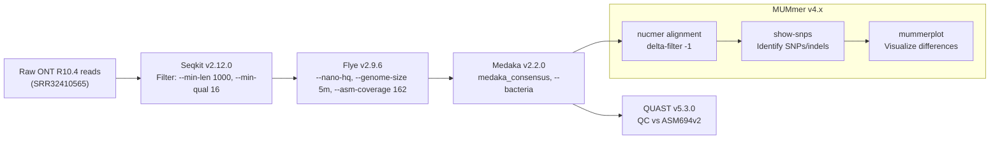

# Genome assembly and variant analysis of *Salmonella enterica* from nanopore long reads

## Introduction
The development of whole genome sequencing and assembly technology has enabled foundational discoveries for understanding virulence factors and pathogen evolution, particularly for clinically relevant species (1). *De novo* genome assembly refers to the recovery of an organism's genome without mapping sequenced DNA fragments to a reference. Unlike reference mapping, *de novo* assembly avoids reference bias, enables the discovery of novel sequences, and facilitates the identification of structural variation (2). However, the process can present notable challenges that hinder the construction of complete, accurate genomes. A notable challenge in *de novo* assembly is balancing read length and accuracy. Short-read sequencing produces highly accurate reads, but building long, contiguous sequences is challenging because repetitive elements are longer than the reads. Even with high sequencing coverage, short reads may not span these repeats, limiting the completeness of the assembly (3). In contrast, long-read sequencing technologies such as Oxford Nanopore Technologies (ONT) generate reads that span repetitive regions and produce more contiguous assemblies, but have until recently been unreliable due to systematic errors such as inaccurate homopolymer detection (4).

ONT long-read sequencing works by guiding a DNA or RNA molecule through a protein nanopore fixed to a flow cell membrane. As the molecule passes through the channel, multiple adjacent nucleotides influence the electrical current, producing a signal that is translated into a sequence. Unlike short-read sequencing, the molecule does not need to be fragmented or amplified, enabling the formation of long, contiguous sequences (5). With their latest R10 chemistry, the nanopore channel is longer, allowing for dual sensors that better inform the electrical signals used for basecalling and produce more accurate results (4).

This analysis focuses on assembling the *Salmonella enterica* genome and comparing its variants to a reference using raw sequencing data generated by ONT R10.4. *S. enterica* is a clinically significant foodborne pathogen that causes millions of cases of enterovirus yearly, sometimes leading to severe illness or death (6). Additionally, its single circular chromosome, repeat complexity, and well-characterized reference strains make it useful as a model organism in studies evaluating genome assembly tools (7, 8).

Currently, there are many assembly tools designed to recover prokaryote genomes using ONT long-read technology. Among the most common are Canu, NECAT, and Flye. When deciding on a tool to use for prokaryotic genome assembly, it is important to consider accuracy, contiguity, consistency, circularisation, computational efficiency, and ease of use. These tools all produce consistent results amongst different datasets, but differ in the remaining criteria (9, 10). Canu has extensive error correction mechanisms and produces highly contiguous assemblies, but is resource intensive and can produce structural errors if coverage is not sufficient (10). NECAT consistently produces the most contiguous assemblies that often achieve circularity relatively quickly (9, 10), but is cumbersome to use and can produce larger scale errors than the other tools (10). Finally, Flye is often referred to as a balanced assembler, as it has high contiguity, and is relatively accurate, but can be memory intensive (9, 10). Furthermore, accuracy and circularisation show notable improvements when polishing tools are subsequently used (9, 10). Overall, the best assembly tool depends on the intended application and the context of the pipeline as a whole.

This analysis will assemble the *S. enterica* genome from raw ONT reads obtained from NCBI using Flye in order to balance computational efficiency, accuracy and contiguity. Reads will be filtered using SeqKit, assembled with Flye, polished with Medaka and assessed for quality using QUAST. The proposed workflow is largely based on the approach of Bogaerts and colleagues (11), who conducted phylogenetic analysis and investigated cluster detection of *S. enterica* and *Neisseria meningitidis*. For variant calling, the assembly will be aligned to the *S. enterica* reference genome using Minimap2, followed by file processing with SAMtools. Variants will be called using MUMmer, which is well-suited for assembly-to-reference variant detection (12), and results will be visualized in IGV. While read-based variant calling tends to produce more precise results (12), this analysis aims to evaluate assembly quality and variation from an assembled genome.

## Methods
### Data filtering and assembly
Raw ONT R10.4 reads from NCBI SRA (SRR32410565) will be used for the analysis. To ensure the read quality meets the standards assumed by Flye’s `--nano-hq` option, Seqkit v2.12.0 (13) will be used with `--min-len` of 1000 to filter reads less than 1kb in length as done by Bogaerts and colleagues (11), and `--min-qual` of 16 for a Phred score corresponding to an error rate of less than 3% as expected by Flye `--nano-hq`. Flye v2.9.6-b1802 (14) will be used to assemble the genome using the `--nano-hq` option for ONT R10 data with `--genome-size 5m` to specify the 5 000 000 base pair genome size of *S. enterica*. Additionally, `--asm-coverage` will be set to 162, calculated from the sequencing yield of 809 Mb reported in the dataset metadata. Following assembly, Medaka v2.2.0 (15) will be used to create a polished consensus assembly using `medaka_consensus` with the `--bacteria` option to use a model optimized for bacteria that improves consensus accuracy (15). For quality checking, QUAST v5.3.0 (16) will be used to evaluate assembly quality using the *S. enterica* reference genome (ASM694v2). Assembly quality and completeness will be evaluated using QUAST metrics including the number of contigs, total assembly length, N50 value, missing N’s per 100 kbp, and the number of indels per 100 kbp relative to the reference genome. 

### Variant calling and visualization
For variant detection, the polished assembly `.fasta` produced by Medaka will be aligned to the reference genome using MUMmer v4.x (17). The `nucmer` subtool will align the assembly to the reference genome with `delta-filter -1`  to produce a one-to-one alignment that will be used by the `show-snps` subtool to identify SNPs and indels. Finally, the `mummerplot` subtool will be used to visualize the differences between the reference and the assembled genome.

### Pipeline 

## References
1. Didelot X, Bowden R, Wilson DJ, Peto TEA, Crook DW. 2012. Transforming clinical microbiology with bacterial genome sequencing. Nature Reviews Genetics 13:601–612. [doi:10.1038/nrg3226](https://doi.org/10.1038/nrg3226) 
2. Chaisson MJP, Wilson RK, Eichler EE. 2015. Genetic variation and the de novo assembly of human genomes. Nature Reviews Genetics 16:627–640. [doi:10.1038/nrg3933](https://10.1038/nrg3933) 
3. Kingsford C, Schatz MC, Pop M. 2010. Assembly complexity of prokaryotic genomes using short reads. BMC Bioinformatics 11. [doi:10.1186/1471-2105-11-21](https://doi.org/10.1186/1471-2105-11-21) 
4. Sereika M, Kirkegaard RH, Karst SM, Michaelsen TY, Sørensen EA, Wollenberg RD, Albertsen M. 2022. Oxford Nanopore R10.4 long-read sequencing enables the generation of near-finished bacterial genomes from pure cultures and metagenomes without short-read or reference polishing. Nature Methods 19:823–826. [doi:10.1038/s41592-022-01539-7](https://doi.org/10.1038/s41592-022-01539-7) 
5. Garalde DR, Snell EA, Jachimowicz D, Sipos B, Lloyd JH, Bruce M, Pantic N, Admassu T, James P, Warland A, Jordan M, Ciccone J, Serra S, Keenan J, Martin S, McNeill L, Wallace EJ, Jayasinghe L, Wright C, Blasco J. 2018. Highly parallel direct RNA sequencing on an array of nanopores. Nature Methods 15:201–206. [doi:10.1038/nmeth.4577](https://doi.org/10.1038/nmeth.4577) 
6. McClelland M, Sanderson KE, Spieth J, Clifton SW, Latreille P, Courtney L, Porwollik S, Ali J, Dante M, Du F, Hou S, Layman D, Leonard S, Nguyen C, Scott K, Holmes A, Grewal N, Mulvaney E, Ryan E, Sun H. 2001. Complete genome sequence of Salmonella enterica serovar Typhimurium LT2. Nature 413:852–856. [doi:10.1038/35101614](https://doi.org/10.1038/35101614) 
7. Ramisse V, Perrine Houssu, Hernandez EM, Hilaire V, Lisanti O, Françoise Ramisse, Cavallo J-D, Gilles Vergnaud. 2004. Variable Number of Tandem Repeats in Salmonella enterica subsp. enterica for Typing Purposes. Journal of Clinical Microbiology 42:5722–5730. [doi: 10.1128/JCM.42.12.5722-5730.2004](https://doi.org/10.1128/JCM.42.12.5722-5730.2004) 
8. Chen Z, Erickson DL, Meng J. 2020. Benchmarking hybrid assembly approaches for genomic analyses of bacterial pathogens using Illumina and Oxford Nanopore sequencing. BMC Genomics 21. [doi:10.1186/s12864-020-07041-8](https://doi.org/10.1186/s12864-020-07041-8) 
9. Kumar MS, Krishna MB, Soman KP, Stanley J, Pourmand N, Suravajhala P, Babu TGSatheesh. 2025. Benchmarking long-read assembly tools and preprocessing strategies for bacterial genomes: A case study on E. coli DH5α. Biotechnology Reports 48:e00931. [doi:10.1016/j.btre.2025.e00931](https://doi.org/10.1016/j.btre.2025.e00931) 
10. Wick RR, Holt KE. 2021. Benchmarking of long-read assemblers for prokaryote whole genome sequencing [version 4; peer review: 4 approved]. F1000Research 8:2138. [doi:10.12688/f1000research.21782.4](https://doi.org/10.12688/f1000research.21782.4)
11. Bogaerts B, Maex M, Commans F, Goeders N, Van den Bossche A, De Keersmaecker SCJ, Roosens NHC, Ceyssens P-J, Mattheus W, Vanneste K. 2025. Oxford Nanopore Technologies R10 sequencing enables accurate cgMLST-based bacterial outbreak investigation of Neisseria meningitidis and Salmonella enterica when accounting for methylation-related errors. Journal of Clinical Microbiology 63. [doi:10.1128/jcm.00410-25](https://doi.org/10.1128/jcm.00410-25) 
12. Wick RR, Judd LM, Stinear TP, Monk IR. 2025. Are reads required? High-precision variant calling from bacterial genome assemblies. Access Microbiology 7. [doi: 10.1099/acmi.0.001025.v3](https:doi.org/10.1099/acmi.0.001025.v3) 
13. Shen W, Le S, Li Y, Hu F. 2016. SeqKit: A Cross-Platform and Ultrafast Toolkit for FASTA/Q File Manipulation. PLOS ONE 11:e0163962. [doi:10.1371/journal.pone.0163962](https://doi.org/10.1371/journal.pone.0163962) 
14. Kolmogorov M, Yuan J, Lin Y, Pevzner PA. 2019. Assembly of long, error-prone reads using repeat graphs. Nature Biotechnology 37:540–546. [doi:10.1038/s41587-019-0072-8](https://doi.org/10.1038/s41587-019-0072-8) 
15. '2021.' nanoporetech/medaka. GitHub. [github.com/nanoporetech/medaka](https://github.com/nanoporetech/medaka).
16. Gurevich A, Saveliev V, Vyahhi N, Tesler G. 2013. QUAST: quality assessment tool for genome assemblies. Bioinformatics 29:1072–1075. [doi:10.1093/bioinformatics/btt086](https://doi.org/10.1093/bioinformatics/btt086) 
17. Marçais G, Delcher AL, Phillippy AM, Coston R, Salzberg SL, Zimin A. 2018. MUMmer4: A fast and versatile genome alignment system. PLOS Computational Biology 14:e1005944. [doi:10.1371/journal.pcbi.1005944](https://doi.org/10.1371/journal.pcbi.1005944)
