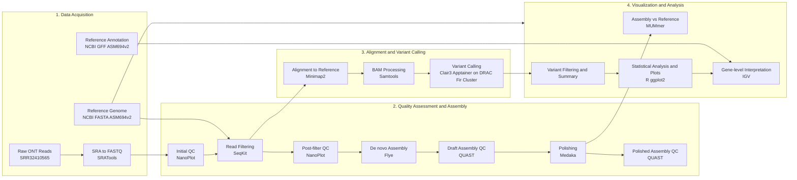
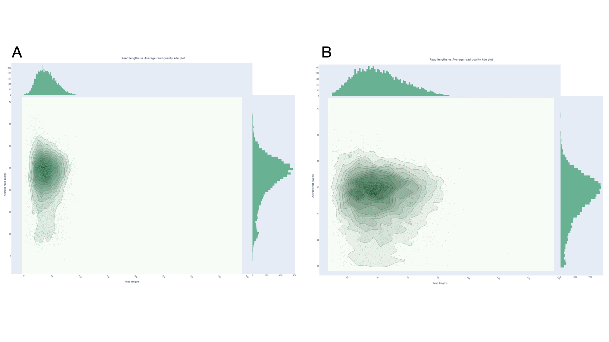
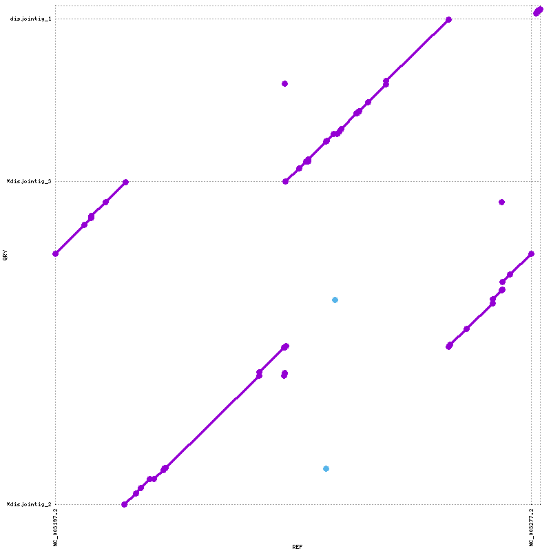
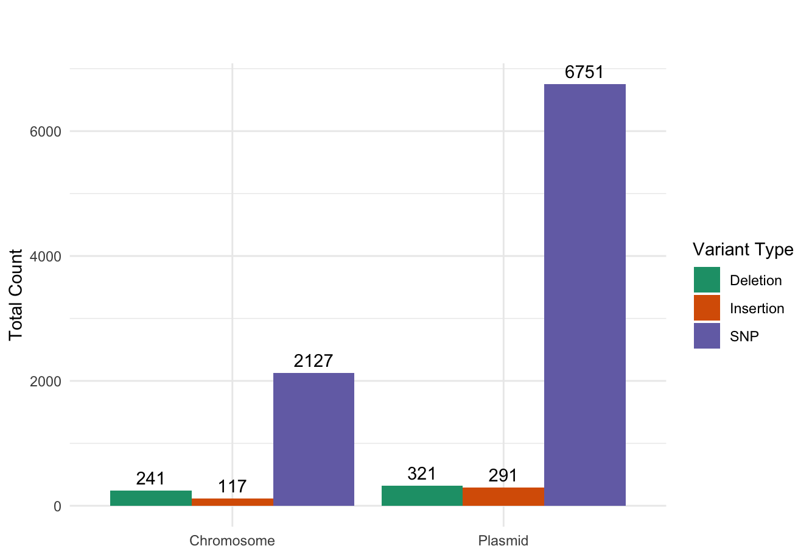
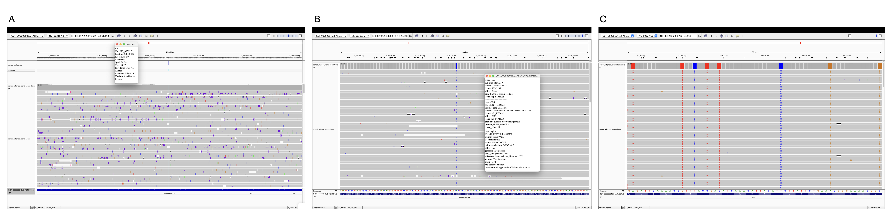

# Genome assembly and variant analysis of *Salmonella enterica* from nanopore long reads
## Introduction
The development of whole genome sequencing and assembly technology has enabled foundational discoveries for understanding virulence factors and pathogen evolution, particularly for clinically relevant species (1). *De novo* genome assembly refers to the recovery of an organism's genome without mapping sequenced DNA fragments to a reference. Unlike reference mapping, *de novo* assembly avoids reference bias, enables the discovery of novel sequences, and facilitates the identification of structural variation (2). However, the process can present notable challenges that hinder the construction of complete, accurate genomes. A notable challenge in *de novo* assembly is striking a balance between read length and accuracy. Short-read sequencing produces highly accurate reads; however, building long, contiguous sequences is challenging because repetitive elements are often longer than the reads. Even with high sequencing coverage, short reads may not span these repeats, limiting the completeness of the assembly (3). In contrast, long-read sequencing technologies such as Oxford Nanopore Technologies (ONT) generate reads that span repetitive regions and produce more contiguous assemblies, but have until recently been unreliable due to systematic errors such as inaccurate homopolymer detection (4).

ONT long-read sequencing works by guiding a DNA molecule through a protein nanopore fixed to a flow cell membrane. As the molecule passes through the channel, multiple adjacent nucleotides influence the electrical current, which produces a signal that is translated into a sequence. Unlike short-read sequencing, the molecule does not need to be fragmented or amplified, which enables the formation of long, contiguous sequences (5). With their R10 release, the nanopore channel is longer to allow for dual sensors. The dual sensors better inform the electrical signals used for basecalling, producing more accurate results (4).

This analysis focuses on assembling the *Salmonella enterica* genome and comparing the assembly to a reference using raw sequencing data generated by ONT R10.4. *S. enterica* is a clinically significant foodborne pathogen that causes millions of cases of enterovirus yearly, sometimes leading to severe illness or death (6). Additionally, its single circular chromosome, repeat complexity, and well-characterized reference strains make it useful as a model organism in studies evaluating genome assembly tools (7, 8).

Currently, there are many assembly tools designed to recover prokaryotic genomes using ONT long-read technology. Among the most common are Canu (9), NECAT (10), and Flye (11). When deciding on a tool to use for prokaryotic genome assembly, it is important to consider accuracy, contiguity, consistency, circularisation, computational efficiency, and ease of use. These tools all produce consistent results amongst different datasets, but differ in the remaining criteria (12, 13). Canu has extensive error correction mechanisms and produces highly contiguous assemblies, but it is resource-intensive and can produce structural errors if coverage is not sufficient (13). NECAT consistently produces the most contiguous assemblies that often achieve circularity relatively quickly (12, 13), but it is cumbersome to use and can produce larger-scale errors than the other tools (13). Finally, Flye is often referred to as a balanced assembler, as it has high contiguity and is relatively accurate, but can be memory-intensive (12, 13). Furthermore, accuracy and circularisation show notable improvements when polishing tools are subsequently used (12, 13). Overall, the best assembly tool depends on the intended application and the context of the pipeline as a whole.

This analysis describes the assembly process of the *S. enterica* genome from raw ONT reads using Flye (11), and highlights notable structural changes and variants between the sample isolate and the reference genome that may impact virulence. Prior to assembly, quality assessment of raw reads was performed with NanoPlot (14), and were filtered accordingly using SeqKit (15). Assembly was conducted using Flye in order to balance computational efficiency, accuracy, and contiguity. Post-assembly polishing with Medaka (16) was used to refine consensus accuracy and quality assessments were conducted with QUAST (17) before and after polishing the assembly. The workflow was largely based on the approach of Bogaerts and colleagues (18), who conducted phylogenetic analysis and investigated cluster detection of *S. enterica* and *Neisseria meningitidis*. Clair3 (19) was used for variant calling. Prior to variant calling, raw reads were first aligned to the *S. enterica* reference genome using Minimap2 (20), and sorted and indexed with Samtools (21). Subsequently, the polished assembly was aligned to the *S. enterica* reference genome using MUMmer `nucmer`, (22) followed by a visual assessment of structural variations between the assembly and reference genomes using `mummerplot`. Finally, visualizations of variant types was done in R using ggplot2 (23, 24) and specific SNPs were visually identified using IGV (25)

## Methods
### Computational Resources
The analysis was conducted using a combination of local and high-performance computing resources. The majority of the workflow was performed on a local Apple Macbook Pro with M4 architecture. On the local system, Conda was used to manage virtual environments and dependencies. For computationally intensive parts of the pipeline, specifically variant calling, analyses were conducted on the Digital Research Alliance of Canada’s Fir high-performance computing cluster (26), where Clair3 v1.0.10 (19) was used via a Singularity container within a SLURM job.

### Data Filtering 
Raw ONT R10.4 reads from NCBI SRA (SRR32410565) were used for the analysis. NanoPlot v1.46.2 (14) was used to assess read quality before and after filtering. Seqkit v2.12.0 (15) was used with `--min-len` of 1000 and `--min-qual` of 10 to filter reads less than 1kb in length and less than Phred score 10 as done by Bogaerts and colleagues (18). 

### Genome Assembly and Quality Assessment
Flye v2.9.6-b1802 (11) was used to assemble the genome using the `--nano-hq` option specified in the tool documentation for ONT R10 data with `--genome-size 5m` to specify the 5 000 000 base pair genome size of *S. enterica*. Additionally, `--asm-coverage` was set to 157, calculated from the sequencing yield of 785 Mb reported in the metadata after filtering by Seqkit. Following assembly, Medaka v2.2.0 (15) was used to create a polished consensus assembly using `medaka_consensus` with the `-m r1041_e82_400bps_sup_v5.2.0` option to use the latest available model tuned for ONT high quality reads. QUAST v5.3.0 (16) was used to evaluate assembly quality before and after polishing using the *S. enterica* reference genome (ASM694v2). Assembly quality and completeness was examined with metrics from the QUAST report, including the total length, number of contigs, N50, GC content, genome fraction, and misassemblies relative to the reference genome. Additionally, Structural comparison between the assembly and the reference genome was performed using `nucmer` v3.1 for whole-genome alignment and `mummerplot` v3.5 for dot-plot visualization in the MUMmer suite (22).

### Variant Calling
Minimap2 v2.30-r1287 (20) was used to align the filtered ONT reads to the reference genome using the `-a` flag to generate output alignments in SAM format and the `-x map-ont` option for ONT long-read alignment. Although ONT R10.4 chemistry achieves higher accuracy than the described error rate in the Minimap2 documentation for `map-ont`, its error rate is still higher than that of the R14 chemistry. Therefore, the `-x lr:hq` option was not considered appropriate for this dataset. Samtools v1.23 (21) was used to convert the SAM file to BAM format, then to sort and index the alignment and reference genome. Variant calling with Clair3 was executed using the `r1041_e82_400bps_sup_v500` model, which is the latest available model and the best suited for ONT high-quality reads. For visualizing variants, ggplot2 v4.0.2 (24) in R v4.5.1 (23)  was used to display the proportion of variant types in the bacterial chromosome and the plasmid. IGV v2.19.7 (25) was used to interactively identify notable single nucleotide polymorphisms (SNPs) by viewing the reference genome, pre-processed reads, and genome annotation file. 

### Pipeline

```mermaid
flowchart LR
  A[Raw ONT Reads<br/>SRR32410565]

  subgraph H1[1. Data Acquisition]
    A --> B[SRA to FASTQ<br/>SRATools]
    C[Reference Genome<br/>NCBI FASTA ASM694v2]
    D[Reference Annotation<br/>NCBI GFF ASM694v2]
  end

  subgraph H2[2. Quality Assessment and Assembly]
    B --> E[Initial QC<br/>NanoPlot]
    E --> F[Read Filtering<br/>SeqKit]
    F --> G[Post-filter QC<br/>NanoPlot]
    G --> H[De novo Assembly<br/>Flye]
    H --> I[Draft Assembly QC<br/>QUAST]
    I --> J[Polishing<br/>Medaka]
    J --> K[Polished Assembly QC<br/>QUAST]
  end

  subgraph H3[3. Alignment and Variant Calling]
    F --> L[Alignment to Reference<br/>Minimap2]
    L --> M[BAM Processing<br/>Samtools]
    M --> N[Variant Calling<br/>Clair3 Apptainer on DRAC Fir Cluster]
  end

  subgraph H4[4. Visualization and Analysis]
    J --> O[Assembly vs Reference<br/>MUMmer]
    N --> P[Variant Filtering and Summary]
    P --> Q[Statistical Analysis and Plots<br/>R ggplot2]
    Q --> R[Gene-level Interpretation<br/>IGV]
  end

  %% New independent connections
  C --> F
  C --> H4
  D --> R
```
Figure 1. Schematic representation of the workflow used for genome assembly and variant calling to assess differences between *Salmonella enterica* SRR32410565 isolate and reference genome. 

## Results 
### Genome Assembly
Following filtering with NanoPlot, average quality of reads, average read length, quality, and N50 value, increased, reducing noise prior to assembly (Table 1, Figure 2). 

| Metric | Raw Reads | Filtered Reads |
--- | --- | ---
Mean read length | 4,128.4 | 4,165.7
Mean read quality | 18.9 | 20.3
Median read length | 3,957.0 | 3,980.0
Median read quality | 23.7 | 23.8
Number of reads | 196,031.0 | 188,542.0
N50 | 4,683.0 | 4,688.0
Total Bases | 809,296,219.0 | 785,406,207.0

Table 1. Metrics comparing average raw ONT read length and quality, as well as number of reads and N50 values before and after filtering with Seqkit and quality visualization with NanoPlot.

Figure 2. NanoPlot length (x-axis) versus quality (y-axis) summary of (A) raw ONT reads and (B) quality-controlled reads after removing sequences <1 kb and with a Phred score <10 using Seqkit.

The draft assembly showed high contiguity, and was nearly complete, with three contigs covering 95.6% of the genome (Table 2). While Medaka polishing improved total length and N50 value, the marginal improvements suggest that the draft assembly produced by Flye was already of high-quality (Table 2). The final polished assembly consisted of three contigs:  disjointig 1 (109 kb), which was circularized and aligns with the bacterial plasmid, and disjointigs 2 (1.67 Mb) and 3 (3.31 Mb), which align with the chromosome. However, the gaps separating disjointigs 2 and 3 confirm the genome was not fully closed (Figure 3). Interestingly, while the assembly accounts for the majority of the reference genome, some relocations are apparent (Figure 3). 

| Metric | Draft Assembly | Polished Assembly
--- | --- | --- 
Total length without reference (bp) | 5,151,055 | 5,151,063
Total length aligned (bp) | 4,762,475 | 4,762,484
Number of contigs | 3 | 3
N50 (bp) | 3,333,392 | 3,333,397
GC content (%) | 52.19 | 52.19
Genome fraction (%) | 95.601 | 95.601
Misassemblies (relocations) | 26 | 26

Table 2. QUAST metrics comparing total length, number of contigs, N50 values, genome fraction of assemblies and read coverage for plasmid and chromosome before and after polishing with Medaka. 

Figure 3. Dot-plot comparison between the polished *S. enterica* assembly and the reference genome, illustrating synteny and structural variations.

### Variant Calling
Variant calling with Clair3 revealed a distinct distribution of variant types; single-nucleotide polymorphisms (SNPs) occurred 9-fold more than deletions and 20-fold more than insertions on the chromosome, and 21-fold more than deletions and 23-fold more than insertions on the plasmid (Figure 4). Overall, the observed rate of variation on the plasmid is notably high, with SNP frequency representing a 144-fold increase compared to that of the chromosome, despite the Flye output indicating only a 1.48-fold increase in plasmid sequence coverage compared to the chromosome.

Figure 4. Distribution of variant types on the assembled *S. enterica* chromosome and plasmid. Deletions (green), insertions (orange), and single-nucleotide polymorphisms (SNPS; purple) are displayed for both genomic components.

An investigation of SNPs in the isolate’s chromosome and plasmid revealed three genomic regions with notable variations. The *fliC* gene contained a nonsynonymous mutation at position 2,048,377 on the chromosome (C → T), resulting in an amino acid substitution from glutamic acid (E) to lysine (K). The variant was called with a quality score of 38.8 (Figure 5A). Additionally, the *STM1239* (*sopF*) gene also contained a nonsynonymous mutation at position 1,326,724 (A → C), resulting in a threonine (T) to proline (P) amino acid substitution. This variant was called with a high quality score of 110 (Figure 5B). Finally, a series of eight SNPs located in the *traE* gene on the plasmid (position 63,762 to 63,858) were identified. These plasmid variants were called with high confidence, with allele frequencies between 93% and 100%, suggesting they are present in nearly all of the isolate’s plasmid population. Additionally, all variations in this region were synonymous (Figure 5C).

Figure 5. IGV visualizations of genomic regions containing notable variations. (A) A nonsynonymous mutation in the *fliC* gene (C → T) resulting in a glutamic acid (E) to lysine (K) amino acid change. (B) A nonsynonymous mutation in the *STM1239 (sopF)* gene (A → C), resulting in a threonine (T) to proline (P) amino acid substitution. (C) A cluster of eight synonymous mutations in the plasmid-encoded *traE* gene. 

## Discussion
### Structural Analysis
In this study, the *Salmonella enterica* genome was successfully assembled, *de novo* from a sample isolate, recovering 95.6% of the reference genome across 3 contigs. While the assembly had high similarity to the reference genome, some structural variation was detected in the form of relocations (Figure 3). One possible explanation for relocations could be that Flye failed to resolve repeats because reads may not have spanned ribosomal operons. Seeing as *S. enterica* contains ribosomal operons of approximately 6.5 Kb in length (27), and the N50 value for filtered reads was 4.5 Kb (Table 1), it is possible that there was not enough unique sequence coverage to recover the correct location for these repeats. However, it is also possible that the relocations in the assembly reflect an alternate genome structure compared to the reference. Bacterial organisms undergo large-scale chromosomal rearrangements due to prophage activity (28) and ribosomal operons (29) that impact growth rates and gene expression. To determine the underlying reason for genomic relocations in the assembled genome, future work can investigate read coverage at alignment junctions. Furthermore, completing the assembly into a single, circular contig would allow for further analysis of genome structures resulting from ribosomal operons (31).

### Variant Analysis
Beyond large-scale structural differences between the assembly and reference genome, comprehensive analysis of variants revealed a notably larger proportion of variants on the plasmid relative to the chromosome. The 144-fold increase in SNPs (Figure 4) is consistent with a recent experiment showing plasmids exhibit five times higher spontaneous mutation rates than chromosomes, even at equivalent copy number (32), potentially due to higher error rates and less efficient repair mechanisms.

A higher mutation rate is consistent with the cluster of synonymous mutations found in the *traE* gene, encoded on the virulence plasmid pSLT (Figure 5C). *traE* is important for facilitating conjugative transfer (33). As this gene is an important contributor to horizontal transfer, the absence of non-synonymous mutations suggests it could be under strong purifying selection. Alternatively, studies have found that synonymous mutations can have functional impacts and fitness costs (34, 35). In this isolate, the accumulation of synonymous mutations in *traE* may indicate the population’s adaptation to a specific environment by tuning codon usage and mRNA levels rather than neutral drift.

Contrastingly, the investigation of specific SNPs on the chromosome revealed potential functional modifications in key virulence associated proteins, *fliC* (Figure 5A) and *sopF* (Figure 5B). *fliC*, also known as flagellin, is crucial for bacterial pathogenicity, as it is necessary for motility, chemical sensing and response, as well as binding to host cells (36). Previous research has shown that a complete knockout of *fliC* causes *S. enterica* to be non-motile (37), and flagellated, non-motile mutants exhibit reduced host-invasion capabilities (38). The identification of a nonsynonymous mutation in *fliC* in this isolate may represent a functional alteration in motility and invasion. The gene products of *sopF* have been found to associate with host cell membranes, primarily for promoting stability of the *Salmonella*-containing vacuole (SCV) in non-phagocytic cells (39). An amino acid substitution in this area could suggest an adaptation to specific phagocytic cell types.

### Conclusion
This study successfully resolved the *Salmonella enterica* genome to a high degree of contiguity using Oxford Nanopore long-read sequencing and the Flye assembler. This workflow allowed for the identification of structural variations, quantification of variant density between plasmid and chromosome, and assessment of potential functional mutations. Ultimately, this analysis provides insights into bacterial genome variation that can be explored further for deeper understanding of virulence factors and pathogenicity of *S. enterica.*

## References 

1. Didelot X, Bowden R, Wilson DJ, Peto TEA, Crook DW. 2012. Transforming clinical microbiology with bacterial genome sequencing. Nature Reviews Genetics 13:601–612. [doi:10.1038/nrg3226](https://doi.org/10.1038/nrg3226)

2. Chaisson MJP, Wilson RK, Eichler EE. 2015. Genetic variation and the de novo assembly of human genomes. Nature Reviews Genetics 16:627–640. [doi:10.1038/nrg3933](https://10.1038/nrg3933)

3. Kingsford C, Schatz MC, Pop M. 2010. Assembly complexity of prokaryotic genomes using short reads. BMC Bioinformatics 11. [doi:10.1186/1471-2105-11-21](https://doi.org/10.1186/1471-2105-11-21)

4. Sereika M, Kirkegaard RH, Karst SM, Michaelsen TY, Sørensen EA, Wollenberg RD, Albertsen M. 2022. Oxford Nanopore R10.4 long-read sequencing enables the generation of near-finished bacterial genomes from pure cultures and metagenomes without short-read or reference polishing. Nature Methods 19:823–826. [doi:10.1038/s41592-022-01539-7](https://doi.org/10.1038/s41592-022-01539-7)

5. Garalde DR, Snell EA, Jachimowicz D, Sipos B, Lloyd JH, Bruce M, Pantic N, Admassu T, James P, Warland A, Jordan M, Ciccone J, Serra S, Keenan J, Martin S, McNeill L, Wallace EJ, Jayasinghe L, Wright C, Blasco J. 2018. Highly parallel direct RNA sequencing on an array of nanopores. Nature Methods 15:201–206. [doi:10.1038/nmeth.4577](https://doi.org/10.1038/nmeth.4577) 

6. McClelland M, Sanderson KE, Spieth J, Clifton SW, Latreille P, Courtney L, Porwollik S, Ali J, Dante M, Du F, Hou S, Layman D, Leonard S, Nguyen C, Scott K, Holmes A, Grewal N, Mulvaney E, Ryan E, Sun H. 2001. Complete genome sequence of Salmonella enterica serovar Typhimurium LT2. Nature 413:852–856. [doi:10.1038/35101614](https://doi.org/10.1038/35101614)

7. Ramisse V, Perrine Houssu, Hernandez EM, Hilaire V, Lisanti O, Françoise Ramisse, Cavallo J-D, Gilles Vergnaud. 2004. Variable Number of Tandem Repeats in Salmonella enterica subsp. enterica for Typing Purposes. Journal of Clinical Microbiology 42:5722–5730. [doi: 10.1128/JCM.42.12.5722-5730.2004](https://doi.org/10.1128/JCM.42.12.5722-5730.2004) 

8. Chen Z, Erickson DL, Meng J. 2020. Benchmarking hybrid assembly approaches for genomic analyses of bacterial pathogens using Illumina and Oxford Nanopore sequencing. BMC Genomics 21. [doi:10.1186/s12864-020-07041-8](https://doi.org/10.1186/s12864-020-07041-8) 

9. Koren, S. et al. Canu: scalable and accurate long-read assembly via adaptive k-mer weighting and repeat separation. Genome Research 27, 722–736 (2017). [doi:10.1101/gr.215087.116](https://doi:10.1101/gr.215087.116) 

10. Chen, Y. et al. Efficient assembly of nanopore reads via highly accurate and intact error correction. Nature Communications 12, (2021). [doi:10.1038/s41467-020-20236-7](https://doi.org/10.1038/s41467-020-20236-7) 

11. Kolmogorov M, Yuan J, Lin Y, Pevzner PA. 2019. Assembly of long, error-prone reads using repeat graphs. Nature Biotechnology 37:540–546. [doi:10.1038/s41587-019-0072-8](https://doi.org/10.1038/s41587-019-0072-8) 

12. Kumar MS, Krishna MB, Soman KP, Stanley J, Pourmand N, Suravajhala P, Babu TGSatheesh. 2025. Benchmarking long-read assembly tools and preprocessing strategies for bacterial genomes: A case study on E. coli DH5α. Biotechnology Reports 48:e00931. [doi:10.1016/j.btre.2025.e00931](https://doi.org/10.1016/j.btre.2025.e00931) 

13. Wick RR, Holt KE. 2021. Benchmarking of long-read assemblers for prokaryote whole genome sequencing [version 4; peer review: 4 approved]. F1000Research 8:2138. [doi:10.12688/f1000research.21782.4](https://doi.org/10.12688/f1000research.21782.4)

14. De Coster Wouter & Rademakers, R. NanoPack2: Population scale evaluation of long-read sequencing data. Bioinformatics 39, (2023). [doi:10.1093/bioinformatics/btad311](https://doi.org/10.1093/bioinformatics/btad311) 

15. Shen W, Le S, Li Y, Hu F. 2016. SeqKit: A Cross-Platform and Ultrafast Toolkit for FASTA/Q File Manipulation. PLOS ONE 11:e0163962. [doi:10.1371/journal.pone.0163962](https://doi.org/10.1371/journal.pone.0163962) 

16. 2021. nanoporetech/medaka. GitHub. [github.com/nanoporetech/medaka](https://github.com/nanoporetech/medaka)

17. Gurevich A, Saveliev V, Vyahhi N, Tesler G. 2013. QUAST: quality assessment tool for genome assemblies. Bioinformatics 29:1072–1075. [doi:10.1093/bioinformatics/btt086](https://doi.org/10.1093/bioinformatics/btt086) 

18. Bogaerts B, Maex M, Commans F, Goeders N, Van den Bossche A, De Keersmaecker SCJ, Roosens NHC, Ceyssens P-J, Mattheus W, Vanneste K. 2025. Oxford Nanopore Technologies R10 sequencing enables accurate cgMLST-based bacterial outbreak investigation of Neisseria meningitidis and Salmonella enterica when accounting for methylation-related errors. Journal of Clinical Microbiology 63. [doi:10.1128/jcm.00410-25](https://doi.org/10.1128/jcm.00410-25) 

19. Zheng, Z. et al. Symphonizing pileup and full-alignment for deep learning-based long-read variant calling. Nature Computational Science 2, 797–803 (2022). [doi:10.1038/s43588-022-00387-x/](https://doi.org/10.1038/s43588-022-00387-x) 

20. Li, H. Minimap2: pairwise alignment for nucleotide sequences. Bioinformatics 34, 3094–3100 (2018). [doi:10.1093/bioinformatics/bty191] (https://doi.org/10.1093/bioinformatics/bty191)

21. Danecek, P. et al. Twelve years of SAMtools and BCFtools. GigaScience 10, (2021). [doi:10.1093/gigascience/giab008](https://doi.org/10.1093/gigascience/giab008)

22. Marçais G, Delcher AL, Phillippy AM, Coston R, Salzberg SL, Zimin A. 2018. MUMmer4: A fast and versatile genome alignment system. PLOS Computational Biology 14:e1005944. [doi:10.1371/journal.pcbi.1005944](https://doi.org/10.1371/journal.pcbi.1005944)

23. R Core Team. R: A Language and Environment for Statistical Computing. R Foundation for Statistical Computing [https://www.r-project.org/](https://www.r-project.org) (2025).

24. Wickham, H. Ggplot2 : Elegant Graphics For Data Analysis. (Springer-Verlag New York, 2016). [https://ggplot2.tidyverse.org](https://ggplot2.tidyverse.org) 

25. Robinson, J. T. et al. Integrative genomics viewer. Nature Biotechnology 29, 24–26 (2011). [doi: 10.1038/nbt.1754](https://doi.org/10.1038/nbt.1754) 

26. Government of Canada. Digital Research Alliance of Canada. [Alliance​can​.ca](https://alliancecan.ca) (2023). 

27. Helm, R. A. & Maloy, S. Rapid Approach To Determine rrn Arrangement in Salmonella Serovars. Applied and Environmental Microbiology 67, 3295–3298 (2001). [doi: 10.1128/AEM.67.7.3295-3298.2001](https://doi.org/10.1128/AEM.67.7.3295-3298.2001) 

28. Nakagawa, I. Genome Sequence of an M3 Strain of Streptococcus pyogenes Reveals a Large-Scale Genomic Rearrangement in Invasive Strains and New Insights into Phage Evolution. Genome Research 13, 1042–1055 (2003). [doi:10.1101/gr.1096703](https://doi.org/10.1101/gr.1096703)

29. Waters, E. V., Tucker, L. A., Ahmed, J. K., Wain, J. & Langridge, G. C. Impact of Salmonella genome rearrangement on gene expression. Evolution Letters 6, 426–437 (2022). [doi:10.1002/evl3.305](https://doi.org/10.1002/evl3.305)

30. Matthews, T. D., Rabsch, W. & Maloy, S. Chromosomal rearrangements in Salmonella enterica serovar Typhi strains isolated from asymptomatic human carriers. mBio 2, e00060-11 (2011). [doi: 10.1128/mBio.00060-11](https://doi.org/10.1128/mBio.00060-11)

31. Page, A. J., Ainsworth, E. V. & Langridge, G. C. socru: typing of genome-level order and orientation around ribosomal operons in bacteria. Microbial Genomics 6, (2020). [doi:10.1099/mgen.0.000396](https://doi.org/10.1099/mgen.0.000396)

32. Ramiro-Martínez, P. et al. Plasmid mutation rates scale with copy number. Proceedings of the National Academy of Sciences 123, (2026). [doi: 10.1073/pnas.2526088123](https://doi.org/10.1073/pnas.2526088123)

33. Frankel, G. et al. Plasmids pick a bacterial partner before committing to conjugation. Nucleic Acids Research 51, 8925–8933 (2023). [doi: 10.1093/nar/gkad678](https://doi.org/10.1093/nar/gkad678)

34. Zhang, J. & Qian, W. Functional synonymous mutations and their evolutionary consequences. Nature Reviews Genetics (2025) [doi:10.1038/s41576-025-00850-1](https://doi.org/10.1038/s41576-025-00850-1)

35. Knöppel, A., Näsvall, J. & Andersson, D. I. Compensating the Fitness Costs of Synonymous Mutations. Molecular Biology and Evolution 33, 1461–1477 (2016). [doi:10.1093/molbev/msw028](https://doi.org/10.1093/molbev/msw028)

36. Duan, Q., Zhou, M., Zhu, L. & Zhu, G. Flagella and bacterial pathogenicity. Journal of Basic Microbiology 53, 1–8 (2012). [10.1002/jobm.201100335](https://doi/10.1002/jobm.201100335)

37. Rosu, V., Chevance, F. F. V., Karlinsey, J. E., Hirano, T. & Hughes, K. T. Translation Inhibition of the Salmonella fliC Gene by the fliC 5′ Untranslated Region, fliC Coding Sequences, and FlgM. Journal of Bacteriology 188, 4497–4507 (2006). [doi:10.1128/jb.01552-05](https://doi.org/10.1128/jb.01552-05)

38. Asten, van, Hendriks, J. M., Jos F.J.G. Koninkx & Dijk, van. Flagella-mediated bacterial motility accelerates but is not required for Salmonella serotype Enteritidis invasion of differentiated Caco-2 cells. International Journal of Medical Microbiology 294, 395–399 (2004). [doi:10.1016/j.ijmm.2004.07.012](https://doi.org/10.1016/j.ijmm.2004.07.012)

39. Lau, N. et al. SopF, a phosphoinositide binding effector, promotes the stability of the nascent Salmonella-containing vacuole. PLOS Pathogens 15, e1007959–e1007959 (2019). [doi:10.1371/journal.ppat.1007959](https://doi.org/10.1371/journal.ppat.1007959)
